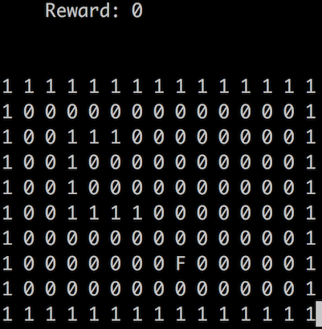

## Installation
```sh
git clone git@github.com:wing3s/snake_game.git
cd snake_game
# Install app required packages
pip install -r requirements.txt
```

#### Note
If you are using virtualenv (like 'pyenv'), please follow below steps.

```sh
# Install a Python version
PYTHON_CONFIGURE_OPTS="--enable-unicode=ucs2 --enable-framework CC=clang" pyenv install <your_python_version>
pyenv virtualenv <your_python_version> <your_virtualenv_name>
# Install app required packages
git clone git@github.com:wing3s/snake_game.git
cd snake_game
# Install app required packages
pyenv activate <your_virtualenv_name>
pip install -r requirements.txt
# add missing file for matplotlib in Python virtualenv
echo "backend: TkAgg" >> ~/.matplotlib/matplotlibrc
```
## Play the game
```sh
python terminal.py
```
- 1: snake or wall
- F: target fruit

