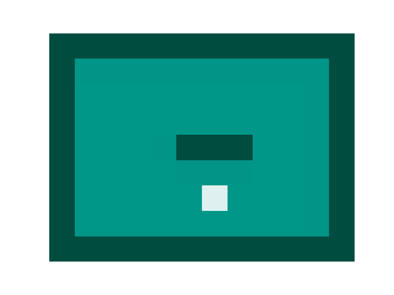
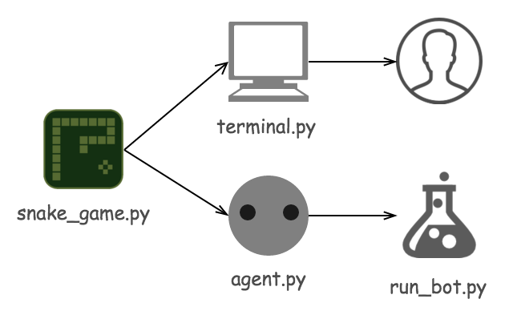

# Snake Game
Play classic Nokia snake game by reinforcement learning with Keras. 
This project is a great starting point to learn how reinforcement learning works and implementation of deep learning with Keras.
[Keras](https://keras.io) is a high level Python deep learning library based on [Theano](https://github.com/Theano/Theano) or [TensorFlow](https://github.com/tensorflow/tensorflow).
We use Q-learning to teach snake how to move. This [Q-learning tutorial](http://mnemstudio.org/path-finding-q-learning-tutorial.htm) is an awesome material to get the idea how it works.




- [Play the game](#play_the_game)
- [Train your bot](#train_the_bot)


## Installation
```sh
git clone git@github.com:wing3s/snake_game.git
cd snake_game
# Install app required packages
pip install -r requirements.txt
```

### Note
If you have any issue with matplotlib package installation, please follow below steps.
##### MacOS with virtualenv (pyenv)
```sh
# Install a Python version
PYTHON_CONFIGURE_OPTS="--enable-unicode=ucs2 --enable-framework CC=clang" pyenv install <your_python_version>
pyenv virtualenv <your_python_version> <your_virtualenv_name>
# Install app required packages
git clone git@github.com:wing3s/snake_game.git
cd snake_game
# Install app required packages
pyenv activate <your_virtualenv_name>
pip install -r requirements.txt
# add missing file for matplotlib in Python virtualenv
echo "backend: TkAgg" >> ~/.matplotlib/matplotlibrc
```
##### Ubuntu with virtualenv (pyenv)
```sh
# Install freestyle, png packages
sudo apt-get install freetype* libpng*
# Install a Python version
PYTHON_CONFIGURE_OPTS="--enable-shared" pyenv install <your_python_version>
pyenv virtualenv <your_python_version> <your_virtualenv_name>
# Install app required packages
git clone git@github.com:wing3s/snake_game.git
cd snake_game
# Install app required packages
pyenv activate <your_virtualenv_name>
pip install -r requirements.txt
```

### Code Structure


## Play the game<a name="play_the_game"></a>
```sh
python terminal.py
```
Simply move the snake by arrow keys ←, → ↑ ↓.

- 1: snake or wall
- F: target fruit


## Train the bot<a name="train_the_bot"></a>
```sh
python run_bot.py
```
Trained model is saved to `/models` with its json structure and weights by default.

## Reference
This project is inspired by following resources.

- [https://github.com/bitwise-ben/Snake](https://github.com/bitwise-ben/Snake)
- [https://github.com/farizrahman4u/qlearning4k](https://github.com/farizrahman4u/qlearning4k)